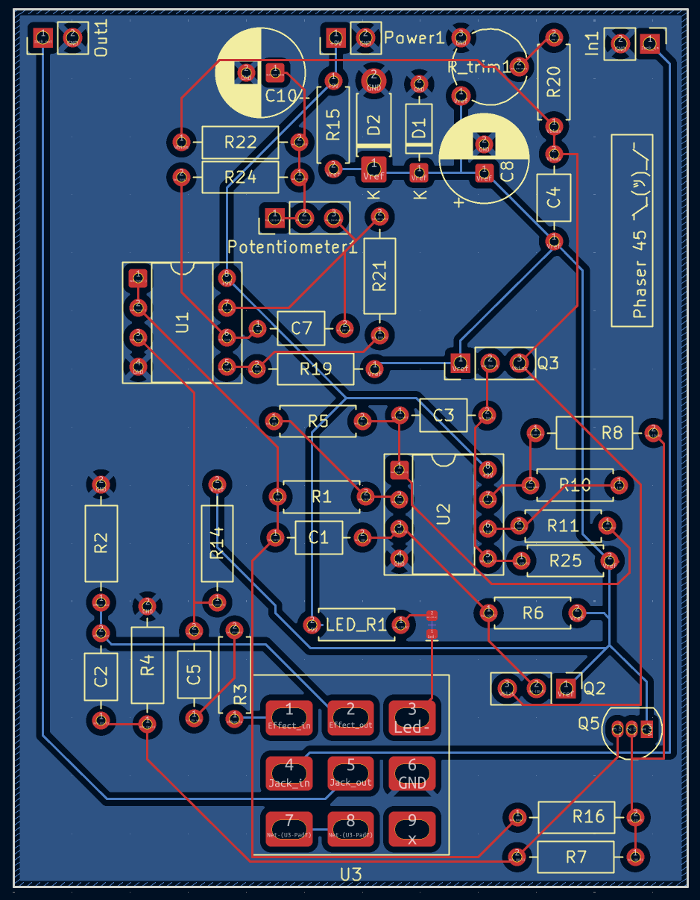

# analog-phaser-pedal
Analog phaser guitar pedal with a custom PCB designed in KiCad.
See more details in [Project Notes](project_notes.md)

## Files

- KiCad schematic
- PCB layout
- Example PCB render

## Tools

- KiCad 9
- Through-hole components

## Notes

This was one of my first PCB layouts. Possible improvements:

- LED replacement from SMT to THT
- trace routing optimization
- switching noise reduction when engaging bypass

## PCB Layout

